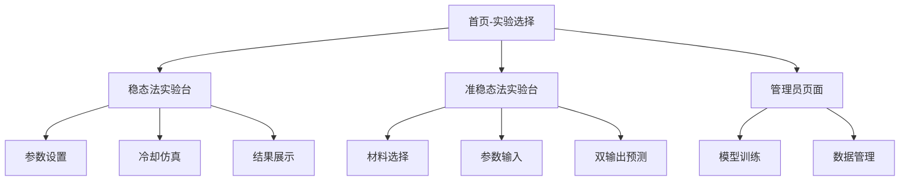

# 热传导实验虚拟仿真Web应用 - 产品需求文档

## 1. 产品概述

本产品是一个基于Web的热传导实验虚拟仿真平台，将现有的稳态法、准稳态法和神经网络修正的导热系数测量Python代码重构为可交互的在线实验应用。用户可在线选择实验方法、设定参数、查看实时曲线与结果，并支持数据上传下载和实验报告导出。

该产品主要解决传统热传导实验设备昂贵、操作复杂、数据处理繁琐的问题，为科研人员和学生提供便捷的虚拟实验环境。通过神经网络修正提高测量精度，实现了理论计算与机器学习的有机结合。

目标是打造一个专业级的热物性参数测量仿真平台，支持多种实验方法和材料类型，具备完整的数据分析和可视化功能。

## 2. 核心功能

### 2.1 用户角色

| 角色 | 注册方式 | 核心权限 |
|------|----------|----------|
| 普通用户 | 无需注册，直接访问 | 可使用所有实验功能、数据导入导出 |
| 管理员 | 密码验证 | 可访问模型训练、数据管理等高级功能 |

### 2.2 功能模块

本应用包含以下主要页面：
1. **实验选择页**：选择稳态法或准稳态法实验，查看方法介绍
2. **稳态法实验台**：T1/T3输入、铜块冷却仿真、导热系数预测
3. **准稳态法实验台**：V_t/ΔV输入、双输出λ和c预测、理论对比
4. **管理员页面**：模型训练、数据管理、系统配置

### 2.3 页面详情

| 页面名称 | 模块名称 | 功能描述 |
|----------|----------|----------|
| 实验选择页 | 方法选择卡片 | 展示稳态法和准稳态法的适用材料、观测量、公式说明 |
| 实验选择页 | 导航菜单 | 提供快速跳转到各实验页面的入口 |
| 稳态法实验台 | 参数输入表单 | 输入T1、T3温度值，支持手动输入和CSV上传 |
| 稳态法实验台 | 冷却仿真器 | 基于铜块物理模型生成T1(t)冷却曲线 |
| 稳态法实验台 | 实时曲线图 | 绘制T1(t)、T2(t)、ΔT/Δt(t)时间序列 |
| 稳态法实验台 | 结果展示卡片 | 显示预测λ值、修正参数a/b、C常数等中间结果 |
| 稳态法实验台 | 数据导出 | 支持CSV、PNG、PDF格式的结果导出 |
| 准稳态法实验台 | 材料参数设置 | 选择glass/rubber材料，设置V_t、ΔV等电学参数 |
| 准稳态法实验台 | 物理常数编辑 | 可编辑电阻、面积、厚度、密度等物理参数 |
| 准稳态法实验台 | 双输出预测 | 同时预测导热系数λ和比热容c |
| 准稳态法实验台 | 理论对比图 | 展示神经网络预测值vs理论公式计算值的散点图 |
| 准稳态法实验台 | 残差分析 | 显示预测误差分布和置信区间 |
| 准稳态法实验台 | 历史记录表 | 保存用户的输入参数和预测结果历史 |
| 管理员页面 | 模型训练控制 | 触发重新训练、查看训练进度和损失曲线 |
| 管理员页面 | 数据集管理 | 上传新的实验数据、查看现有数据集统计 |
| 管理员页面 | 模型版本管理 | 查看模型文件版本、性能指标、切换模型 |

## 3. 核心流程

### 3.1 稳态法实验流程
用户进入稳态法实验页面 → 选择自动仿真或手动输入模式 → 设置T1、T3参数或上传CSV数据 → 点击计算按钮 → 系统执行T3→T2修正和神经网络预测 → 展示实时曲线和数值结果 → 用户可导出数据和报告

### 3.2 准稳态法实验流程
用户进入准稳态法实验页面 → 选择材料类型(glass/rubber) → 输入电学参数V_t、ΔV → 调整物理常数(可选) → 点击预测按钮 → 系统同时输出λ和c预测值 → 展示与理论值对比和残差分析 → 保存到历史记录 → 支持批量预测和数据导出

### 3.3 管理员操作流程
管理员输入密码验证 → 进入管理页面 → 可选择模型训练、数据管理或系统配置 → 上传新数据集或触发训练 → 监控训练进度 → 查看模型性能指标 → 部署新模型版本

## 4. 用户界面设计

### 4.1 设计风格
- **主色调**：科技蓝(#2563eb)作为主色，配合中性灰(#6b7280)和成功绿(#10b981)
- **按钮样式**：圆角矩形按钮，支持hover和active状态变化
- **字体**：系统默认无衬线字体，标题16-24px，正文14-16px
- **布局风格**：卡片式布局，左侧参数面板+右侧结果展示的经典实验界面
- **图标风格**：使用Heroicons线性图标，保持简洁现代感

### 4.2 页面设计概览

| 页面名称 | 模块名称 | UI元素 |
|----------|----------|--------|
| 实验选择页 | 方法选择卡片 | 大尺寸卡片，包含图标、标题、描述文字，hover效果，点击跳转 |
| 稳态法实验台 | 参数输入面板 | 左侧固定面板，包含数值输入框、单位标签、范围提示、切换开关 |
| 稳态法实验台 | 曲线展示区域 | 右侧主要区域，使用Recharts绘制多条时间序列，支持缩放和导出 |
| 稳态法实验台 | 结果卡片组 | 底部卡片网格，显示关键数值、单位、置信度，使用颜色编码 |
| 准稳态法实验台 | 材料选择器 | 单选按钮组，显示材料图标和物理参数预览 |
| 准稳态法实验台 | 对比散点图 | 预测值vs理论值散点图，包含回归线和R²指标 |
| 准稳态法实验台 | 历史记录表格 | 可排序表格，支持分页、搜索、批量操作 |
| 管理员页面 | 训练控制面板 | 进度条、日志输出、控制按钮，实时更新训练状态 |

### 4.3 响应式设计
采用桌面优先的响应式设计，主要针对1920x1080及以上分辨率优化。在平板和手机端，参数面板将折叠为抽屉式，图表区域自适应缩放，保证核心功能可用性。支持触摸操作优化，图表支持手势缩放。