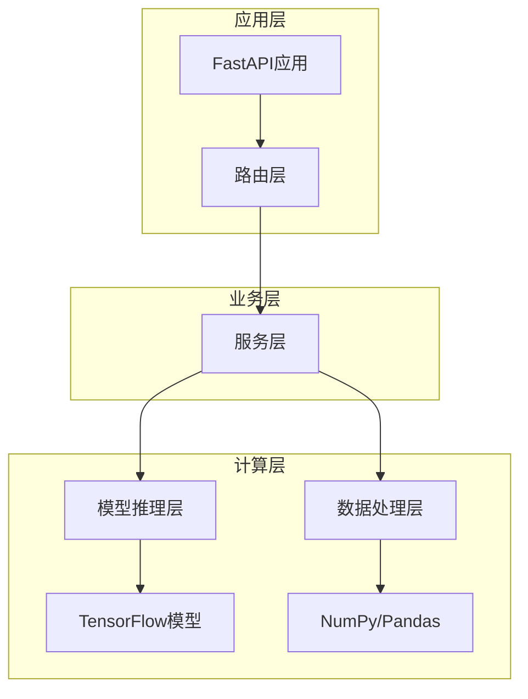
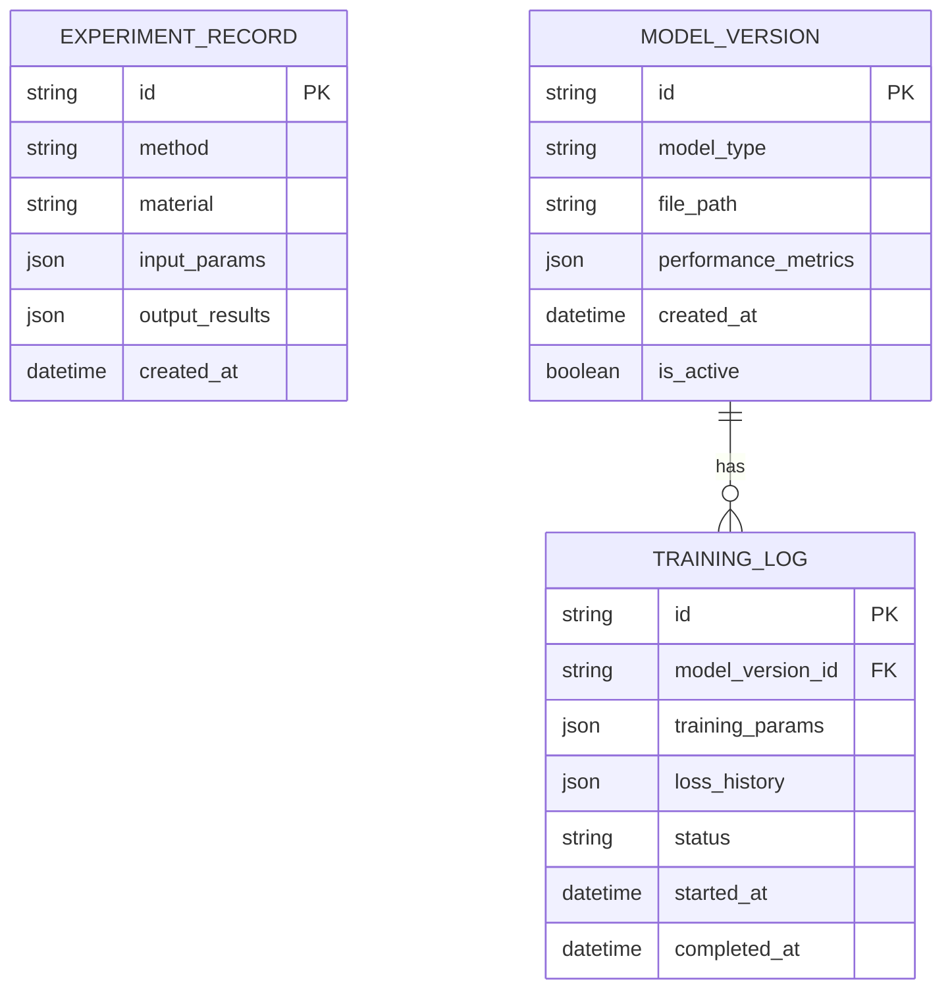

# 热传导实验虚拟仿真Web应用 - 技术架构文档

## 1. 架构设计

```mermaid
graph TD
    A[用户浏览器] --> B[React前端应用]
    B --> C[FastAPI后端服务]
    C --> D[TensorFlow模型推理]
    C --> E[数据处理模块]
    C --> F[文件存储系统]
    
    subgraph "前端层"
        B
    end
    
    subgraph "后端层"
        C
        D
        E
    end
    
    subgraph "数据层"
        F
        G[模型文件(.keras)]
        H[标准化器(.pkl)]
        I[实验数据(.csv)]
    end
    
    C --> G
    C --> H
    C --> I
```

## 2. 技术描述

* 前端：React\@18 + TypeScript\@5 + Vite\@5 + Tailwind CSS\@3 + Recharts\@2

* 后端：FastAPI\@0.104 + Python\@3.10+ + TensorFlow\@2.13 + scikit-learn\@1.3 + NumPy + Pandas + SciPy

* 部署：Docker + docker-compose + uvicorn

## 3. 路由定义

| 路由      | 用途                        |
| ------- | ------------------------- |
| /       | 首页，实验方法选择界面               |
| /steady | 稳态法实验台，支持T1/T3输入和冷却仿真     |
| /quasi  | 准稳态法实验台，支持V\_t/ΔV输入和双输出预测 |
| /admin  | 管理员页面，模型训练和数据管理           |

## 4. API定义

### 4.1 稳态法相关API

**稳态法预测**

```
POST /api/steady/predict
```

请求参数：

| 参数名                 | 参数类型    | 是否必需  | 描述          |
| ------------------- | ------- | ----- | ----------- |
| T1                  | number  | true  | 热端表面温度 (°C) |
| T3                  | number  | true  | 冷端表面温度 (°C) |
| use\_auto\_cooling  | boolean | false | 是否使用自动冷却仿真  |
| constants\_override | object  | false | 物理常数覆盖      |

响应参数：

| 参数名                | 参数类型   | 描述              |
| ------------------ | ------ | --------------- |
| lambda\_pred       | number | 预测的导热系数 W/(m·K) |
| T2\_corrected      | number | 修正后的T2温度        |
| correction\_params | object | 修正参数a, b        |
| C\_constant        | number | 计算常数C           |
| confidence         | number | 预测置信度           |

示例：

```json
{
  "T1": 75.0,
  "T3": 52.0,
  "use_auto_cooling": false
}
```

**冷却仿真**

```
POST /api/steady/simulate-cooling
```

请求参数：

| 参数名          | 参数类型   | 是否必需  | 描述              |
| ------------ | ------ | ----- | --------------- |
| duration     | number | false | 仿真时长 (s)，默认1800 |
| noise\_level | number | false | 噪声水平，默认0.2      |

响应参数：

| 参数名           | 参数类型      | 描述        |
| ------------- | --------- | --------- |
| time          | number\[] | 时间序列      |
| T1            | number\[] | 表面温度序列    |
| T2            | number\[] | 内部温度序列    |
| dTdt          | number\[] | 温度变化率     |
| delta\_ratios | number\[] | ΔT/Δt比值序列 |

### 4.2 准稳态法相关API

**准稳态法预测**

```
POST /api/quasi/predict
```

请求参数：

| 参数名                 | 参数类型   | 是否必需  | 描述                      |
| ------------------- | ------ | ----- | ----------------------- |
| V\_t                | number | true  | 温差热电势 (mV)              |
| delta\_V            | number | true  | 温升热电势变化率 (mV/min)       |
| material            | string | true  | 材料类型 "glass" 或 "rubber" |
| constants\_override | object | false | 物理常数覆盖                  |

响应参数：

| 参数名            | 参数类型   | 描述             |
| -------------- | ------ | -------------- |
| lambda\_pred   | number | 预测导热系数 W/(m·K) |
| c\_pred        | number | 预测比热容 J/(kg·K) |
| lambda\_theory | number | 理论导热系数         |
| c\_theory      | number | 理论比热容          |
| lambda\_error  | number | 导热系数预测误差       |
| c\_error       | number | 比热容预测误差        |

### 4.3 批量处理API

**批量预测**

```
POST /api/batch/predict
```

支持CSV文件上传或JSON数组，返回批量预测结果和错误报告。

### 4.4 系统管理API

**模型信息查询**

```
GET /api/meta/models
```

**模型训练**

```
POST /api/admin/train
```

需要X-Admin-Token认证头。

## 5. 服务器架构图



## 6. 数据模型

### 6.1 数据模型定义



### 6.2 数据定义语言

**实验记录表 (experiment\_records)**

```sql
-- 创建实验记录表
CREATE TABLE experiment_records (
    id VARCHAR(36) PRIMARY KEY DEFAULT (UUID()),
    method VARCHAR(20) NOT NULL CHECK (method IN ('steady', 'quasi')),
    material VARCHAR(20),
    input_params JSON NOT NULL,
    output_results JSON NOT NULL,
    created_at TIMESTAMP DEFAULT CURRENT_TIMESTAMP
);

-- 创建索引
CREATE INDEX idx_experiment_method ON experiment_records(method);
CREATE INDEX idx_experiment_created_at ON experiment_records(created_at DESC);
```

**模型版本表 (model\_versions)**

```sql
-- 创建模型版本表
CREATE TABLE model_versions (
    id VARCHAR(36) PRIMARY KEY DEFAULT (UUID()),
    model_type VARCHAR(50) NOT NULL,
    file_path VARCHAR(255) NOT NULL,
    performance_metrics JSON,
    created_at TIMESTAMP DEFAULT CURRENT_TIMESTAMP,
    is_active BOOLEAN DEFAULT FALSE
);

-- 创建索引
CREATE INDEX idx_model_type ON model_versions(model_type);
CREATE INDEX idx_model_active ON model_versions(is_active);
```

**训练日志表 (training\_logs)**

```sql
-- 创建训练日志表
CREATE TABLE training_logs (
    id VARCHAR(36) PRIMARY KEY DEFAULT (UUID()),
    model_version_id VARCHAR(36),
    training_params JSON,
    loss_history JSON,
    status VARCHAR(20) DEFAULT 'running' CHECK (status IN ('running', 'completed', 'failed')),
    started_at TIMESTAMP DEFAULT CURRENT_TIMESTAMP,
    completed_at TIMESTAMP,
    FOREIGN KEY (model_version_id) REFERENCES model_versions(id)
);

-- 初始化数据
INSERT INTO model_versions (model_type, file_path, is_active) VALUES
('steady_state', 'models/fine_tuned_model.keras', TRUE),
('quasi_steady', 'models/thermal
```

